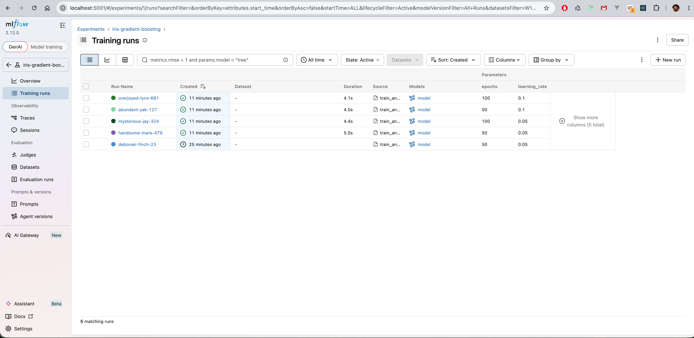
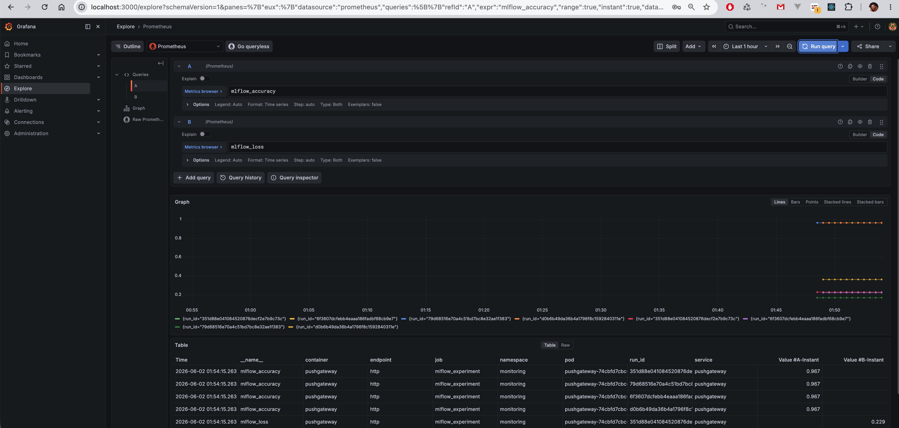

# MLflow Experiments with Prometheus and Grafana

## Project Overview

This project implements ML experiment tracking and monitoring in Kubernetes:

* MLflow Tracking Server stores experiment runs, parameters, metrics, and model artifacts.
* PostgreSQL is used as the MLflow backend store.
* MinIO is used as the S3-compatible artifact store.
* Prometheus PushGateway receives experiment metrics from the training script.
* Prometheus collects PushGateway metrics.
* Grafana visualizes model metrics.
* Kubernetes applications are deployed declaratively through ArgoCD.

## Architecture

```text
train_and_push.py
├── MLflow Tracking Server
│   ├── PostgreSQL backend store
│   └── MinIO artifact store
└── PushGateway
    └── Prometheus
        └── Grafana
```

## Repository Structure

```text
.
├── best_model/
│   └── model.joblib
├── experiments/
│   ├── requirements.txt
│   └── train_and_push.py
├── manifests/
│   └── mlflow/
│       ├── deployment.yaml
│       └── service.yaml
├── namespaces/
│   ├── mlflow/
│   │   ├── minio.yaml
│   │   ├── mlflow.yaml
│   │   ├── postgres.yaml
│   │   └── storageclass.yaml
│   └── monitoring/
│       ├── kube-prometheus-stack.yaml
│       └── pushgateway.yaml
├── screenshots/
│   ├── grafana-explore.png
│   └── mlflow-ui.png
└── README.md
```

## Infrastructure Prerequisites

The Kubernetes cluster, ArgoCD, and Amazon EBS CSI Driver are provisioned through Terraform in the infrastructure repository:

* Terraform repository: [goit-mlops-5-6, branch lesson-8-9](https://github.com/max-ilnytskyi/goit-mlops-5-6/tree/lesson-8-9)

The ArgoCD applications and experiment code are stored in this repository:

* GitOps repository: [goit-argo, branch lesson-8-9](https://github.com/max-ilnytskyi/goit-argo/tree/lesson-8-9)

## Deploy Applications

Create the storage class required by MinIO and PostgreSQL persistent volumes:

```bash
kubectl apply -f namespaces/mlflow/storageclass.yaml
```

Deploy MLflow-related services through ArgoCD:

```bash
kubectl apply -f namespaces/mlflow/minio.yaml
kubectl apply -f namespaces/mlflow/postgres.yaml
kubectl apply -f namespaces/mlflow/mlflow.yaml
```

Deploy monitoring services through ArgoCD:

```bash
kubectl apply -f namespaces/monitoring/pushgateway.yaml
kubectl apply -f namespaces/monitoring/kube-prometheus-stack.yaml
```

Verify ArgoCD applications:

```bash
kubectl get applications -n infra-tools
```

Expected applications:

```text
minio
postgresql
mlflow
pushgateway
kube-prometheus-stack
```

## Verify Kubernetes Services

Check MLflow services:

```bash
kubectl get pods,svc,pvc -n mlflow
```

Expected running workloads:

```text
minio
postgresql
mlflow
```

Check monitoring services:

```bash
kubectl get pods,svc -n monitoring
kubectl get servicemonitor -n monitoring
```

Expected running workloads include:

```text
pushgateway
prometheus
grafana
```

The PushGateway service is available inside the cluster at:

```text
http://pushgateway.monitoring.svc.cluster.local:9091
```

## Access MLflow UI

Forward the MLflow service to the local machine:

```bash
kubectl port-forward svc/mlflow -n mlflow 5001:5000
```

Open:

```text
http://localhost:5001
```

Port `5001` is used locally because port `5000` may be occupied by a macOS system service.

## Access PushGateway

Forward PushGateway to the local machine:

```bash
kubectl port-forward svc/pushgateway -n monitoring 9091:9091
```

Verify health:

```bash
curl -i http://localhost:9091/-/healthy
```

## Run the Experiment

Python 3.11 is required for the dependency versions used in this project.

Create and activate a virtual environment:

```bash
python3.11 -m venv .venv
source .venv/bin/activate
python -m pip install --upgrade pip
pip install -r experiments/requirements.txt
```

Keep the MLflow and PushGateway port-forwards running in separate terminals, then execute:

```bash
MLFLOW_TRACKING_URI=http://localhost:5001 \
PUSHGATEWAY_URL=http://localhost:9091 \
python experiments/train_and_push.py
```

The script:

* loads the Iris dataset;
* trains four `GradientBoostingClassifier` models with different `learning_rate` and `epochs` values;
* logs parameters, metrics, and model artifacts to MLflow;
* pushes `mlflow_accuracy` and `mlflow_loss` metrics to PushGateway with the `run_id` label;
* selects the model with the highest accuracy;
* saves the best local model to `best_model/model.joblib`.

## Verify PushGateway Metrics

With PushGateway port-forward running:

```bash
curl -s http://localhost:9091/metrics | grep -E 'mlflow_accuracy|mlflow_loss'
```

Expected metrics:

```text
mlflow_accuracy{...,run_id="..."} ...
mlflow_loss{...,run_id="..."} ...
```

## View Metrics in Grafana

Forward Grafana locally:

```bash
kubectl port-forward svc/monitoring-grafana -n monitoring 3000:80
```

Open:

```text
http://localhost:3000
```

Credentials:

```text
username: admin
password: admin
```

Navigate to:

```text
Explore → Prometheus
```

Run the following PromQL queries:

```promql
mlflow_accuracy
```

```promql
mlflow_loss
```

The metrics are displayed for each MLflow run using the `run_id` label.

## Screenshots

### MLflow Experiment Runs



### Grafana Explore Metrics



## Cleanup

To avoid unnecessary AWS costs, destroy the created infrastructure after verification:

```bash
cd ../goit-mlops-5-6/eks-vpc-cluster
terraform destroy
```

The bootstrap S3 bucket used for Terraform state can be preserved separately if it is required for future deployments.
